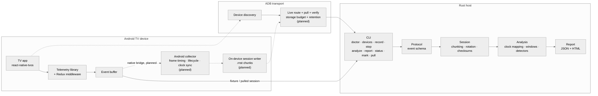
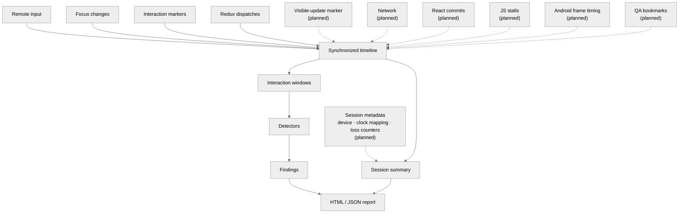

# React Native Session Telemetry

### Architecture

```mermaid
%%{init: {"theme": "neutral"}}%%
flowchart LR
    subgraph Device["Android TV device"]
        direction TB
        App["TV app<br/>react-native-tvos"]
        Lib["Telemetry library<br/>+ Redux middleware"]
        Buffer["Event buffer"]
        Collector["Android collector<br/>frame timing · lifecycle · clock sync<br/>(planned)"]
        Writer["On-device session writer<br/>.rnst chunks<br/>(planned)"]
        App --> Lib --> Buffer
        Buffer -.->|native bridge, planned| Collector
        Collector -.-> Writer
    end

    subgraph Transport["ADB transport"]
        direction TB
        Discover["Device discovery"]
        LivePull["Live route + pull + verify<br/>storage budget + retention<br/>(planned)"]
        Discover --> LivePull
    end

    subgraph Host["Rust host"]
        direction TB
        CLI["CLI<br/>doctor · devices · record · stop<br/>analyze · report · status · mark · pull"]
        Protocol["Protocol<br/>event schema"]
        SessionCrate["Session<br/>chunking · rotation · checksums"]
        Analysis["Analysis<br/>clock mapping · windows · detectors"]
        Report["Report<br/>JSON + HTML"]
        CLI --> Protocol --> SessionCrate --> Analysis --> Report
    end

    App -.-> Discover
    Writer -.-> LivePull
    LivePull --> CLI
    Buffer -->|fixture / pulled session| CLI
```

### Signals

```mermaid
%%{init: {"theme": "neutral"}}%%
flowchart TD
    RemoteInput["Remote input"] --> Timeline["Synchronized timeline"]
    Focus["Focus changes"] --> Timeline
    InteractionMarker["Interaction markers"] --> Timeline
    Redux["Redux dispatches"] --> Timeline
    VisibleUpdate["Visible-update marker<br/>(planned)"] -.-> Timeline
    Network["Network<br/>(planned)"] -.-> Timeline
    ReactCommit["React commits<br/>(planned)"] -.-> Timeline
    JSStall["JS stalls<br/>(planned)"] -.-> Timeline
    FrameTiming["Android frame timing<br/>(planned)"] -.-> Timeline
    Bookmarks["QA bookmarks<br/>(planned)"] -.-> Timeline
    SessionMeta["Session metadata<br/>device · clock mapping · loss counters<br/>(planned)"] -.-> Summary

    Timeline --> Windows["Interaction windows"]
    Timeline --> Summary["Session summary"]
    Windows --> Detectors["Detectors"]
    Detectors --> Findings["Findings"]
    Findings --> ReportOut["HTML / JSON report"]
    Summary --> ReportOut
```

_(dashed = planned, not yet built)_
