## Architecture

| Component                                               | Role                                                                                                                                                                                                              |
| ------------------------------------------------------- | ----------------------------------------------------------------------------------------------------------------------------------------------------------------------------------------------------------------- |
| App + telemetry library (device)                        | The host RN TV app and the embedded library — owns application-semantic signals, batches events, assigns sequence numbers. See [Signal capture](measurement-semantics.md#signal-capture) for each mechanism.      |
| Native capture modules (device)                         | `FrameTimingModule`, `GlobalFocusModule`, `ResourceSamplingModule`, `LifecycleModule` — each forwards raw notifications to the JS library via `RCTDeviceEventEmitter`; JS owns sequencing/timestamps, not native. |
| On-device session writer (device)                       | Native JNI writer — durable `.rnst` chunk storage, independent of and more durable than the bounded JS buffer.                                                                                                    |
| ADB transport                                           | Discovers the device, pulls sealed chunks (checksum-verified via `run-as`), optionally routes live events for `watch`, prunes retained pulled sessions.                                                           |
| Rust host: CLI · Protocol · Session · Analysis · Report | `session-telemetry-cli` (commands) → `-protocol` (wire schema) → `-session` (chunking/rotation/checksums) → `-analysis` (clock mapping, interaction windows, detectors) → `-report` (JSON/HTML), one pipeline.    |
